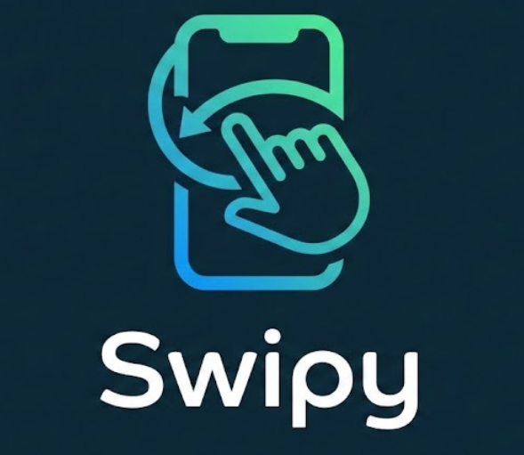

# 📰 Swipy News

<div align="center">
  
  
  **A gesture-based news aggregator that makes staying informed effortless**
  
  [](https://flutter.dev)
  [](https://firebase.google.com)
  [](LICENSE)
</div>

---

## 🌟 Overview

**Swipy News** is a modern, gesture-based news aggregator built with Flutter that combats information overload using an intuitive Tinder-style interface. Powered by a Python web scraper and Firebase backend, it delivers bite-sized news cards where users can:

- **Swipe Left** 👈 to read the full story
- **Swipe Right** 👉 to skip to the next article

With features like duplicate-proof bookmarking, real-time updates, and a smart "all caught up" state, Swipy News makes consuming news fast, engaging, and clutter-free.

---

## ✨ Features

### 🎯 Core Functionality
- **Tinder-Style Swiping**: Intuitive gesture-based navigation through news articles
- **Smart Bookmarking**: Duplicate-proof saving system with persistent storage
- **Real-Time Updates**: Firebase integration for instant news delivery
- **User Authentication**: Secure email/password login and registration
- **Personal Library**: Save and manage your favorite articles
- **Share Articles**: Share interesting stories with friends

### 🎨 User Experience
- **Clean, Modern UI**: Beautiful card-based design with smooth animations
- **Cached Images**: Fast loading with `cached_network_image`
- **"All Caught Up" State**: Lottie animation when you've read all available news
- **Swipe Indicators**: Clear visual feedback for swipe actions
- **Dismissible Saved Items**: Swipe to delete from your library

### 🔐 Security & Privacy
- **Firebase Authentication**: Secure user account management
- **User-Specific Data**: Each user has their own private saved articles collection
- **Secure Backend**: Firebase Firestore for data storage

---

## 🛠️ Tech Stack

### Frontend
- **Framework**: Flutter 3.10.4+
- **Language**: Dart
- **UI Components**:
  - `flutter_card_swiper` - Tinder-style card swiping
  - `cached_network_image` - Optimized image loading
  - `google_fonts` - Custom typography (Poppins)
  - `lottie` - Smooth animations

### Backend
- **Database**: Firebase Firestore
- **Authentication**: Firebase Auth
- **News Logic**: Python automation script
- **AI**: OpenAI GPT-4o-mini (summarization)
- **Data Source**: NewsAPI (raw articles)

### Key Dependencies
```yaml
dependencies:
  firebase_core: ^4.3.0
  cloud_firestore: ^6.1.1
  firebase_auth: ^6.1.3
  flutter_card_swiper: ^7.2.0
  cached_network_image: ^3.4.1
  google_fonts: ^6.3.3
  lottie: ^3.3.2
  url_launcher: ^6.3.2
  share_plus: ^12.0.1
```

### Python Requirements
- `firebase-admin` - Database interaction
- `newsapi-python` - Fetching news
- `openai` - AI summarization


---

## 🚀 Getting Started

### Prerequisites
- Flutter SDK 3.10.4 or higher
- Dart SDK
- Firebase account with a configured project
- Android Studio / Xcode (for mobile development)
- Python (for web scraper - if running backend)

### Installation

1. **Clone the repository**
   ```bash
   git clone https://github.com/yourusername/swipy_app.git
   cd swipy_app
   ```

2. **Install dependencies**
   ```bash
   flutter pub get
   ```

3. **Firebase Setup**
   - Create a Firebase project at [Firebase Console](https://console.firebase.google.com)
   - Enable **Authentication** (Email/Password)
   - Enable **Cloud Firestore**
   - Download `google-services.json` (Android) and place it in `android/app/`
   - Download `GoogleService-Info.plist` (iOS) and place it in `ios/Runner/`
   - Run Firebase CLI to generate configuration:
     ```bash
     flutterfire configure
     ```

4. **Firestore Database Structure**
   
   Create the following collections in Firestore:
   
   **Collection: `news_segments`**
   ```json
   {
     "title": "Article Title",
     "summary": "Brief summary of the article",
     "source": "News Source Name",
     "articleUrl": "https://example.com/article",
     "imageUrl": "https://example.com/image.jpg"
   }
   ```
   
   **Collection: `users/{userId}/saved`** (auto-created)
   ```json
   {
     "title": "Saved Article Title",
     "summary": "Article summary",
     "source": "Source",
     "articleUrl": "https://example.com/article",
     "imageUrl": "https://example.com/image.jpg",
     "savedAt": "Timestamp"
   }
   ```

5. **Run the app**
   ```bash
   flutter run
   ```

### 🐍 Running the News Scraper (Python)

The backend script (`main.py`) fetches the latest tech news, summarizes it using AI, and uploads it to Firestore.

1.  **Install Python Dependencies**
    ```bash
    pip install -r requirements.txt
    ```

2.  **Setup Credentials**
    - Place your Firebase Admin SDK key as `service-account.json` in the root directory.
    - **Configuration**: Open `main.py` and update the following keys:
      ```python
      NEWS_API_KEY = "YOUR_NEWSAPI_KEY"
      OPENAI_API_KEY = "YOUR_OPENAI_KEY"
      ```

    > [!WARNING]
    > **Security Alert**: The `main.py` file contains sensitive API keys. **DO NOT commit this file to public repositories** if you have added real keys. It is recommended to use environment variables (e.g., `python-dotenv`) for production.

3.  **Run the Script**
    ```bash
    python main.py
    ```
    This will:
    - Fetch top tech headlines from NewsAPI
    - Skip articles without images
    - Check if the article already exists in Firestore (deduplication)
    - Summarize the content using OpenAI
    - Save the processed news card to Firestore

---

## 📱 App Structure

```
lib/
├── main.dart           # App entry point, main swipe screen, news cards
├── login_page.dart     # Authentication UI (login/signup)
└── saved_page.dart     # User's saved articles library
```

### Key Components

#### 1. **Main Screen** (`NewsSwipeScreen`)
- Fetches news from Firestore `news_segments` collection
- Implements card swiping with `CardSwiper` widget
- Handles swipe left (read article) and swipe right (skip)
- Shows "all caught up" screen when no more cards

#### 2. **News Card** (`NewsCard`)
- Displays article image, title, summary, and source
- Smart bookmark button with duplicate prevention
- Share functionality
- Real-time bookmark status sync with Firestore

#### 3. **Login Page** (`LoginPage`)
- Email/password authentication
- Toggle between login and signup modes
- Firebase Auth integration

#### 4. **Saved Page** (`SavedPage`)
- Displays user's bookmarked articles
- Real-time updates with Firestore streams
- Swipe-to-delete functionality
- Tap to open article in browser

---

## 🎨 Design Philosophy

### Color Palette
- **Primary**: `#E94057` (Vibrant coral-red)
- **Background**: White
- **Text**: Black with gradient overlays on cards

### Typography
- **Font Family**: Poppins (via Google Fonts)
- Clean, modern, and highly readable

### UX Principles
1. **Gesture-First**: Primary interactions through intuitive swipes
2. **Minimal Friction**: No unnecessary taps or navigation
3. **Visual Feedback**: Clear indicators for all actions
4. **Speed**: Cached images and optimized loading

---

## 🔧 Configuration

### Firebase Security Rules

**Firestore Rules** (`firestore.rules`):
```javascript
rules_version = '2';
service cloud.firestore {
  match /databases/{database}/documents {
    // News segments - read-only for authenticated users
    match /news_segments/{document} {
      allow read: if request.auth != null;
      allow write: if false; // Only admins via backend
    }
    
    // User saved articles - private per user
    match /users/{userId}/saved/{document} {
      allow read, write: if request.auth != null && request.auth.uid == userId;
    }
  }
}
```

**Authentication Rules**:
- Email/Password authentication enabled
- Users can only access their own saved articles

---

## 🐛 Troubleshooting

### Common Issues

1. **Firebase not initializing**
   - Ensure `google-services.json` is in `android/app/`
   - Run `flutterfire configure` to regenerate config
   - Check Firebase project settings

2. **Cards not loading**
   - Verify Firestore has `news_segments` collection with data
   - Check Firestore security rules allow read access
   - Ensure user is authenticated

3. **Images not displaying**
   - Verify `imageUrl` fields contain valid URLs
   - Check internet connection
   - Clear app cache

4. **Bookmark not saving**
   - Check Firestore security rules for `users/{userId}/saved`
   - Verify user is authenticated
   - Check console for errors

---

## 🚧 Roadmap

- [x] **Python Web Scraper Integration**: Automated news fetching with AI summarization
- [ ] **Categories & Filters**: Filter news by topic/source
- [ ] **Dark Mode**: Theme toggle
- [ ] **Push Notifications**: Alert users to breaking news
- [ ] **Offline Mode**: Cache articles for offline reading
- [ ] **Analytics**: Track reading habits and preferences
- [ ] **Social Features**: Follow friends, see what they're reading
- [ ] **Multi-language Support**: Internationalization

---

## 🤝 Contributing

Contributions are welcome! Please follow these steps:

1. Fork the repository
2. Create a feature branch (`git checkout -b feature/AmazingFeature`)
3. Commit your changes (`git commit -m 'Add some AmazingFeature'`)
4. Push to the branch (`git push origin feature/AmazingFeature`)
5. Open a Pull Request

---

## 📄 License

This project is licensed under the MIT License - see the [LICENSE](LICENSE) file for details.

---

## 👨‍💻 Author

**Your Name**
- GitHub: [@yourusername](https://github.com/yourusername)
- Email: your.email@example.com

---

## 🙏 Acknowledgments

- Flutter team for the amazing framework
- Firebase for backend infrastructure
- All open-source package contributors
- News sources for content

---

<div align="center">
  Made with ❤️ and Flutter
  
  **Stay informed, stay swiping!** 📰✨
</div>
